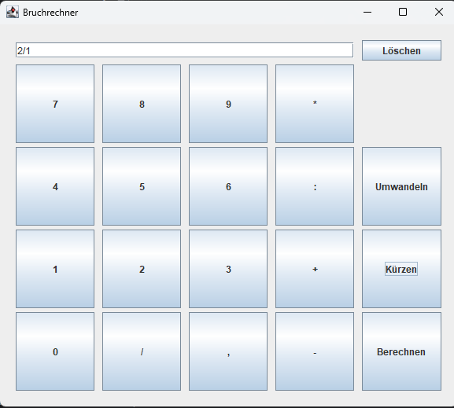

### Aufgabensetzung
•	Umsetzung einer Taschenrechner App in JAVA
•	Layout übernehmen
•	Funktionen implementieren oder vom Vorjahr übernehmen
•	Methoden (Rechenoperationen) sind bereits implementiert (int oder float)
•	Eigene Menü/Calculator Klasse, welche alle Methoden beinhaltet
•	falls neu zu programmieren: Bruchzahlen soll in eigenem Objekt mittels eigener Klasse angelegt werden

### Screenshot

### Funktionen
Kürzen, Alle operatoren bis auf Umwandeln.